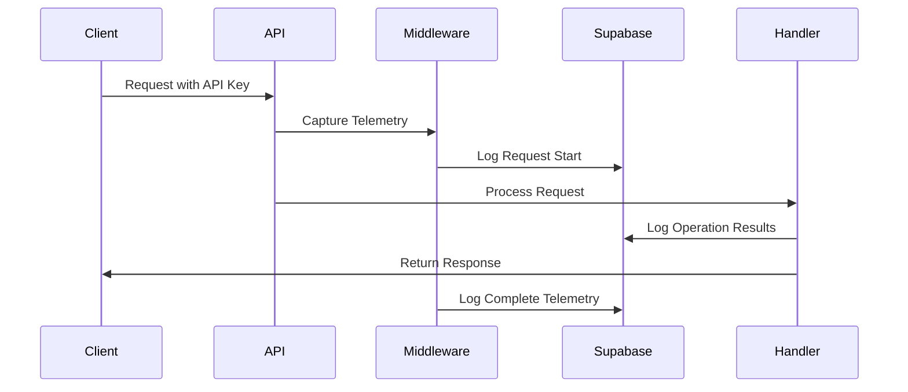
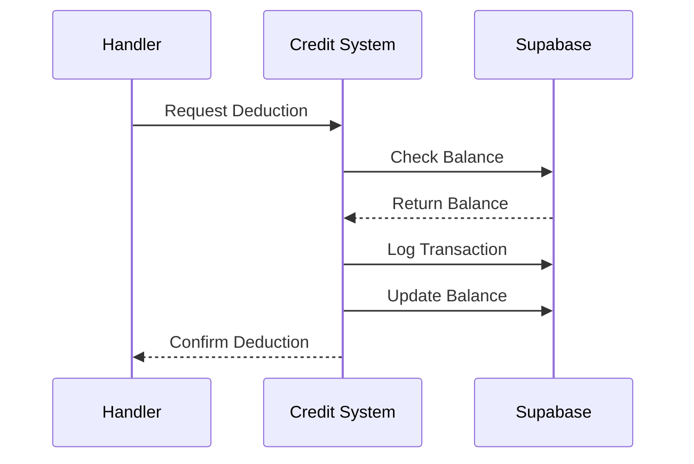

# Supabase Data Infrastructure and Logging Report

## 1. Supabase Client Configuration

### Client Setup
```python
@lru_cache(maxsize=1)
def get_supabase_client():
    supabase_url = os.getenv("SUPABASE_URL")
    supabase_key = os.getenv("SUPABASE_KEY")
    return supabase.create_client(supabase_url, supabase_key)
```

The Supabase client is configured using environment variables and cached using `@lru_cache` for performance optimization. This ensures only one client instance is created and reused.

## 2. Database Tables

The codebase interacts with several Supabase tables:

1. `swarms_cloud_api_keys` - Stores API keys and user associations
2. `swarms_cloud_users_credits` - Manages user credit balances
3. `swarms_cloud_services` - Logs service usage and transactions
4. `swarms_api_logs` - Stores detailed API request logs

## 3. API Key Management

### Verification System
```python
@lru_cache(maxsize=1000)
def check_api_key(api_key: str) -> bool:
    supabase_client = get_supabase_client()
    response = (
        supabase_client.table("swarms_cloud_api_keys")
        .select("*")
        .eq("key", api_key)
        .execute()
    )
    return bool(response.data)
```

- Caches up to 1000 API key verifications
- Used as a dependency in API endpoints via `verify_api_key`
- Integrated with FastAPI's dependency injection system

### User ID Mapping
```python
@lru_cache(maxsize=1000)
def get_user_id_from_api_key(api_key: str) -> str:
    supabase_client = get_supabase_client()
    response = (
        supabase_client.table("swarms_cloud_api_keys")
        .select("user_id")
        .eq("key", api_key)
        .execute()
    )
    if not response.data:
        raise ValueError("Invalid API key")
    return response.data[0]["user_id"]
```

## 4. Logging Infrastructure

### API Request Logging
```python
async def log_api_request(
    api_key: str, 
    data: Union[Dict[str, Any], BaseModel, list]
) -> None:
```

Features:
- Handles multiple data types (Dict, BaseModel, List)
- Automatically converts Pydantic models to dictionaries
- Logs to `swarms_api_logs` table
- Non-blocking async implementation

### Telemetry Logging

The system captures comprehensive telemetry data through middleware:

```python
async def telemetry_middleware(request: Request, call_next):
```

Captures:
- Request metadata (method, path, headers)
- Client information (IP, user agent)
- Server information (hostname, platform)
- System metrics (CPU, memory)
- Timing data
- Response status and duration
- Error information (if applicable)

## 5. Credit Management System

### Credit Deduction
```python
def deduct_credits(api_key: str, amount: float, product_name: str) -> None:
```

Features:
- Handles both free and paid credits
- Uses Decimal for precise arithmetic
- Prioritizes free credits before paid credits
- Logs transactions to `swarms_cloud_services`
- Atomic updates to prevent race conditions

Transaction Flow:
1. Retrieve user credit record
2. Verify sufficient credits
3. Log transaction
4. Update credit balances
5. Handle errors with appropriate HTTP exceptions

## 6. Logging Patterns

### 1. Request-Response Cycle


### 2. Credit Transaction Flow


## 7. Error Handling and Logging

The system implements comprehensive error handling with logging:

1. **Operation Logging**: All major operations are logged
2. **Error Capture**: Detailed error information is captured and stored
3. **Async Error Handling**: Background logging tasks handle errors gracefully
4. **HTTP Exception Mapping**: Errors are mapped to appropriate HTTP status codes

## 8. Performance Considerations

1. **Caching**:
   - API key verification is cached
   - User ID mapping is cached
   - Supabase client is cached

2. **Async Operations**:
   - Non-blocking logging operations
   - Background task processing
   - Concurrent request handling

3. **Error Resilience**:
   - Failed logs don't block main operations
   - Graceful degradation
   - Comprehensive error capture

## 9. Best Practices Implemented

1. **Security**:
   - API key validation
   - Secure credit transactions
   - Error message sanitization

2. **Performance**:
   - Caching strategies
   - Async operations
   - Batch processing

3. **Reliability**:
   - Error handling
   - Transaction logging
   - Atomic operations

4. **Maintainability**:
   - Clear function separation
   - Consistent logging patterns
   - Type annotations

This infrastructure provides a robust foundation for:
- API usage tracking
- User credit management
- System monitoring
- Performance analysis
- Security auditing
- Usage analytics

The combination of Supabase as the data store and the implemented logging patterns creates a comprehensive system for tracking and managing API usage, user credits, and system performance.
